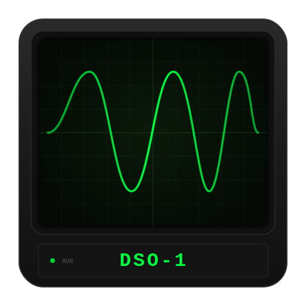

<p align="center">
  
</p>

<h1 align="center">DSO-1 Oscilloscope</h1>

<p align="center">
  <b>Real-time audio visualizer built as a fully functional digital oscilloscope</b><br>
  WebGL-accelerated phosphor simulation &bull; Lissajous patterns &bull; 3D/2D scene rendering &bull; Music-reactive effects
</p>

<p align="center">
  
  
  
  
</p>

---

## What is DSO-1?

DSO-1 is a desktop oscilloscope visualizer that turns audio into real-time beam graphics. Feed it music, a microphone, or the built-in signal generator and watch it render waveforms, Lissajous figures, 3D wireframes, and image traces with authentic CRT phosphor effects.

It's built with Electron and uses WebGL for GPU-accelerated rendering with multi-pass Gaussian blur, phosphor persistence, and beat-reactive visual effects.

---

## Features

### Dual-Channel Oscilloscope

| Feature | Details |
|---------|---------|
| **Channels** | CH1 + CH2 with independent V/DIV (50mV-5V), position, and AC/DC/GND coupling |
| **Timebase** | 1us to 10s/div with fine-grained intermediate steps |
| **Trigger** | Auto, Normal, and Single modes with adjustable level and rising/falling edge |
| **Modes** | YT (voltage vs time) and XY (Lissajous) |
| **Measurements** | Real-time frequency, peak, and RMS readout |
| **Auto Set** | One-click auto-fit for V/DIV and timebase |

### Audio Input

- **File playback** -- drag & drop any audio file (WAV, MP3, OGG, FLAC, AAC) with play/pause, seeking, and volume control
- **Microphone** -- live mic input with one-click toggle
- **Signal generator** -- built-in dual oscillator with sine, square, triangle, and sawtooth waveforms
- **Idle signal** -- test waveform when no input is connected

### Signal Generator & Shape Presets

The signal generator creates Lissajous figures in XY mode with independent L/R frequency, phase (0-360), and amplitude controls. Six L:R ratio presets (1:1, 1:2, 2:3, 3:4, 3:5, 5:8) plus **10 one-click shape presets**:

| | | | | |
|---|---|---|---|---|
| **Circle** | **Figure 8** | **Heart** | **Star** | **Spiral** |
| **Diamond** | **Web** | **Chaos** | **Flower** | **Bowtie** |

Each preset auto-starts the generator in XY mode with tuned frequency ratio, phase, and waveform.

### Beam Effects

| Effect | Description |
|--------|-------------|
| **12 Colors + Custom** | Classic Green, Amber, Cyan, Blue, Indigo, Violet, Magenta, Red, Orange, Yellow, Lime, White, plus a custom hex picker |
| **Reactive** | Beam width and glow pulse with audio amplitude (adjustable strength) |
| **Beat Flash** | Color flash triggered on beat detection (adjustable strength + sensitivity) |
| **Bloom** | Multi-pass wide glow halo around the beam (adjustable strength) |
| **Afterglow** | Phosphor persistence trails with optional rainbow hue shifting |
| **Beat Invert** | Inverts beam color to white on beat |
| **Mirror X/Y** | Horizontal and/or vertical flip copies for symmetry |
| **Rotation** | Slow rotation animation (adjustable speed) |

### Frequency Filter

Band-pass filter with manual Lo/Hi cutoff (20-20000 Hz) and quick presets:

| Bass | Mid | Treble | Highs | Full |
|------|-----|--------|-------|------|
| 20-250 Hz | 250-2000 Hz | 2-6 kHz | 6-20 kHz | 20-20k Hz |

### 3D / 2D Scene Mode

Load 3D wireframe models (`.obj`) or images and render them as phosphor-traced beam graphics.

**3D OBJ Mode:**
- Load any Wavefront `.obj` file
- Per-axis rotation (X, Y, Z) with manual or auto-rotate
- Scale, position, and spin controls

**2D Image Mode:**
- Supports PNG, JPG, GIF, WebP, SVG, AVIF, TIFF, BMP, HEIC, and more
- Three trace modes: **Outline**, **Edges** (Sobel), **Luminance**
- Adjustable threshold and density
- True 3D rotation of the image plane (Rx3D, Ry3D with perspective)
- Images render as **connected line traces** (nearest-neighbor path sorting), not dots
- Independent color from the main beam

**Shared Scene Controls:**
- **Tiling** -- 1-5x grid copies in X/Y
- **Radial symmetry** -- 1-8 rotated copies arranged in a ring
- **Infinite scroll** -- seamless wrapping scroll in X/Y
- **Auto-rotate** per axis with independent speeds
- **Beat pulse** -- scale pulses on beat detection
- **Draw power** -- animate the trace being drawn with auto-ramp and loop

**Music-Reactive Scene Modes:**
- **Breathe** -- audio amplitude modulates scale
- **Shake** -- beat triggers random positional jitter
- **Warp** -- radial displacement using the audio waveform
- **Audio Sketch** -- trace density modulates with amplitude (loud = dense, quiet = sparse)

### CRT Emulation

- **Phosphor persistence** with adjustable decay (WebGL framebuffer ping-pong)
- **CRT curve** -- vintage curved screen effect
- **Scanlines** -- horizontal scan line overlay
- **Measurement grid** with fine/major lines and center crosshair
- **Beam width** and **glow** controls

### Layout System (Rigs)

Arrange panels across 4 drop zones with drag-and-drop:

| Rig | Layout |
|-----|--------|
| **Classic** | All panels in a horizontal strip at the bottom |
| **Studio** | Balanced split -- channels left, effects right, audio under scope |
| **Perform** | Performance-focused -- minimal controls visible, effects prominent |
| **Minimal** | Everything collapsed to the right sidebar |

- **Save custom rigs** with the save button
- **Edit mode** -- drag panels between zones by their title bar
- **Collapsible panels** -- click any panel title to collapse/expand
- All layout state persists across sessions (localStorage)

### Preset System

Save and recall complete oscilloscope configurations:

- **8+ preset slots** with custom naming
- **3 built-in presets**: Classic, Neon Glow, Amber Retro
- **Export/Import** presets as JSON files
- Presets capture everything: channels, timebase, trigger, beam effects, scene settings, display parameters

### Recording & Screenshots

- **Video recording** -- captures the oscilloscope output as MP4 (VP9, 25 Mbps)
- **Screenshots** -- save the current frame as a timestamped PNG
- **Pop-out display** -- open a second window with just the scope output

---

## Keyboard Shortcuts

| Key | Action |
|-----|--------|
| `Space` | Play / Pause audio |
| `Esc` | Stop audio |
| `G` | Toggle grid |
| `C` | Toggle CRT curve |
| `M` | Toggle measurements |
| `F` / `F11` | Toggle fullscreen |
| `1` | YT mode |
| `2` | XY mode |
| `R` | Run / Stop |
| `S` | Single trigger |
| `3` | Toggle 3D/2D scene |
| `Tab` | Switch OBJ / IMG mode |
| `?` | Show shortcut help |

---

## Installation

### From Source

```bash
git clone https://github.com/HesNotTheGuy/Oscilloscope.git
cd Oscilloscope
npm install
npm start
```

### Build Installer

```bash
# Windows NSIS installer
npm run dist:installer

# Portable executable
npm run dist:portable
```

---

## Tech Stack

| Component | Technology |
|-----------|-----------|
| Framework | Electron 33 |
| Rendering | WebGL (GPU Gaussian blur, phosphor persistence, GLSL shaders) |
| Fallback | Canvas 2D with composite blend modes |
| Audio | Web Audio API (AnalyserNode, real-time FFT) |
| Recording | MediaRecorder API (VP9/WebP encoding) |
| 3D | Custom .obj parser with perspective projection |
| Image Trace | Sobel edge detection, nearest-neighbor path sorting |
| Layout | HTML5 Drag and Drop API, localStorage persistence |

---

## Requirements

- **Node.js** 18+
- **Windows** 10/11 (primary platform)
- GPU with WebGL support (any modern GPU)

---

## License

MIT

---

<p align="center">
  <sub>Built with Electron &bull; Rendered with WebGL &bull; Driven by music</sub>
</p>
