<p align="center">
  
</p>

<h1 align="center">DSO-1 Oscilloscope</h1>

<p align="center">
  <b>Real-time audio visualizer built as a fully functional digital oscilloscope</b><br>
  WebGL-accelerated phosphor simulation &bull; Lissajous patterns &bull; 3D/2D scene rendering &bull; Music-reactive effects &bull; 10 visual themes
</p>

<p align="center">
  
  
  
  
  
</p>

---

<p align="center">
  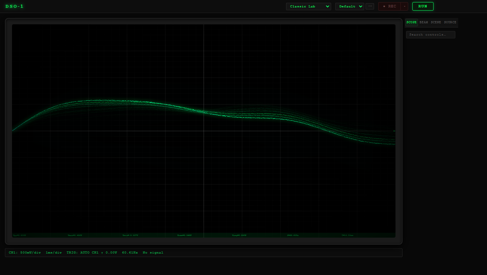
</p>

---

## Table of Contents

- [Why This Exists](#why-this-exists)
- [What is DSO-1?](#what-is-dso-1)
- [Quick Start](#quick-start)
- [The Scope Display](#the-scope-display)
- [Audio Input](#audio-input)
- [Signal Generator & Lissajous](#signal-generator--lissajous)
- [Beam Effects](#beam-effects)
- [Frequency Filter](#frequency-filter)
- [3D / 2D Scene Mode](#3d--2d-scene-mode)
- [Movement FX](#movement-fx)
- [Music-Reactive Modes](#music-reactive-modes)
- [CRT Emulation](#crt-emulation)
- [Presets](#presets)
- [Layout Rigs](#layout-rigs)
- [Themes](#themes)
- [Recording & Output](#recording--output)
- [Keyboard Shortcuts](#keyboard-shortcuts)
- [Easter Eggs](#easter-eggs)
- [Installation](#installation)
- [Tech Stack](#tech-stack)

---

## Why This Exists

Oscilloscope music has been around for a while. The idea of routing audio through a scope and watching geometry materialize on a phosphor screen is genuinely fascinating, but most tools to do it have a steep setup curve, require patching audio through virtual cables, or just don't have the features I wanted to play with.

I wanted something I could open, drop a song into, and immediately get something that looked cool. I also wanted features I hadn't seen elsewhere: image tracing, generative motion effects, a real signal generator for Lissajous figures, beat-reactive visuals, tiling and radial symmetry. And honestly, I partially just wanted to see if I could build something this polished working with Claude. Turns out you can.

## What is DSO-1?

DSO-1 is a desktop oscilloscope visualizer that renders audio as real-time phosphor beam graphics. Feed it music, a microphone, or the built-in signal generator and watch it trace waveforms, Lissajous figures, 3D wireframes, and image silhouettes, all with authentic CRT glow and persistence.

It's a real oscilloscope first. Every control maps to something an actual oscilloscope does: dual channels, adjustable V/DIV, timebase, trigger system, AC/DC coupling, frequency measurements. Then it goes further with GPU shaders, beat detection, 3D models, image tracing, tiling grids, and generative motion effects.

---

## Quick Start

```bash
git clone https://github.com/HesNotTheGuy/Oscilloscope.git
cd Oscilloscope
npm install
npm start
```

Or grab the installer from the [Releases](../../releases) page — no Node.js required.

---

## The Scope Display

<p align="center">
  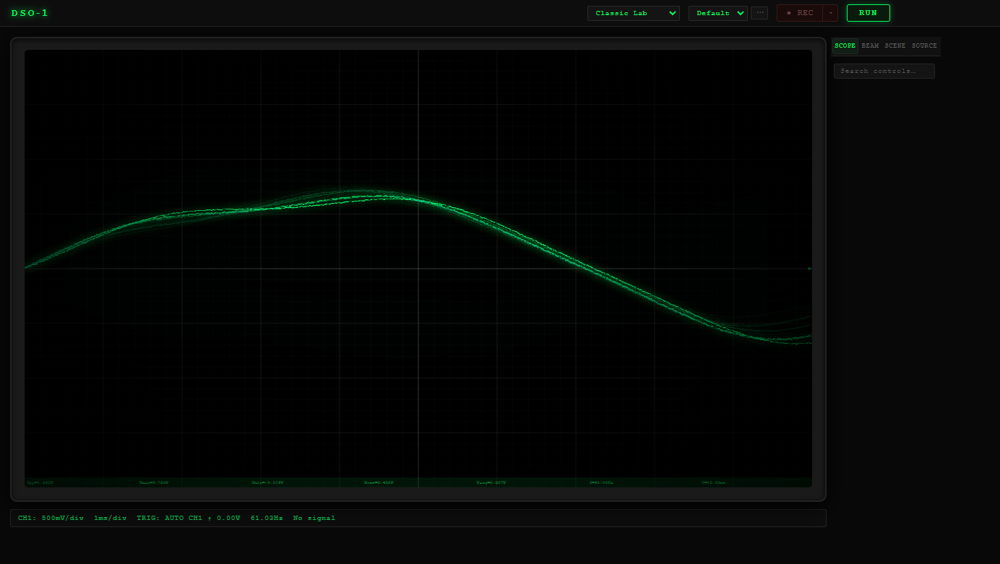
</p>

The main display renders at full WebGL resolution with a multi-pass phosphor pipeline: each frame draws beam geometry into an FBO, runs a separable 9-tap Gaussian blur for glow, then composites onto a persistent phosphor buffer that decays each frame. The result is the characteristic soft-edge, glowing look of a real CRT scope.

### Modes

| Mode | Description |
|------|-------------|
| **YT** | Voltage vs. time — the standard waveform view |
| **XY** | CH1 drives X, CH2 drives Y — Lissajous and phase figures |

### Channels

Two independent input channels with full scope controls:

- **V/DIV** — 50mV to 5V in 11 steps
- **Position** — vertical offset with reset
- **Coupling** — AC (removes DC offset), DC (raw signal), GND (zero line)

### Timebase & Trigger

- **Timebase** — 1µs to 10s/div
- **H-Position** — horizontal scroll through the capture buffer
- **Trigger mode** — Auto, Normal, Single
- **Trigger source** — CH1 or CH2
- **Trigger edge** — Rising or Falling
- **Trigger level** — adjustable with the knob, shown as an arrow marker on the right edge

<p align="center">
  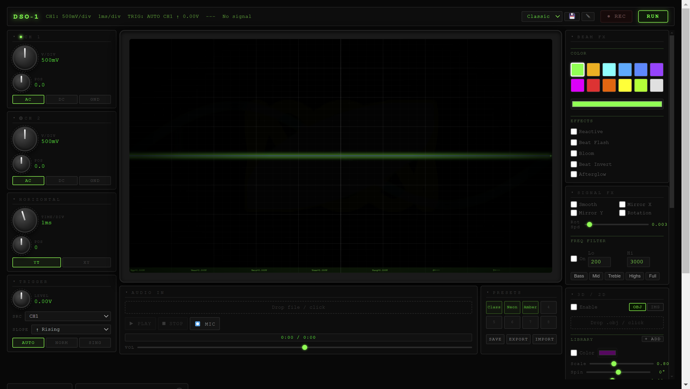
</p>

### Measurements

<p align="center">
  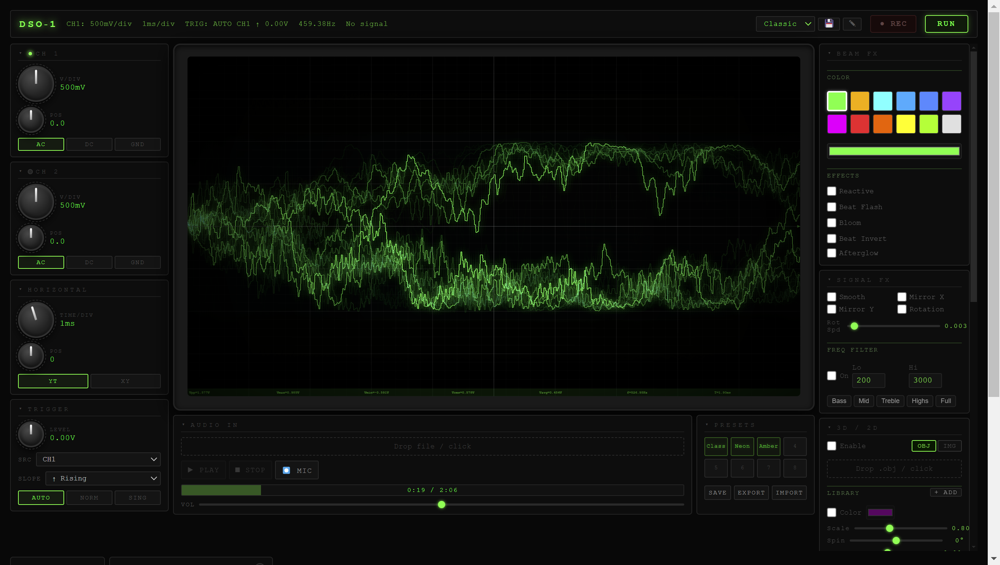
</p>

A readout strip along the bottom of the display shows live measurements updated every 10 frames:

`Vpp` &bull; `Vmax` &bull; `Vmin` &bull; `Vrms` &bull; `Vavg` &bull; `frequency` &bull; `period`

Toggle with **M** or the measurements checkbox.

---

## Audio Input

DSO-1 accepts three signal sources:

### File Playback

Drag and drop any audio file onto the drop zone, or click to browse. Supported formats: **WAV, MP3, OGG, FLAC, AAC, M4A, OPUS, AIFF**. Full transport controls — play, pause, stop, scrub, and volume.

### Microphone

Click the MIC button for live input. The scope shows your voice, instrument, or room audio in real time. Works with any system input device.

### Signal Generator

Built-in dual-channel oscillator — see the [Signal Generator](#signal-generator--lissajous) section below.

> When nothing is connected, a test signal keeps the beam alive so you can configure effects without audio.

---

## Signal Generator & Lissajous

<p align="center">
  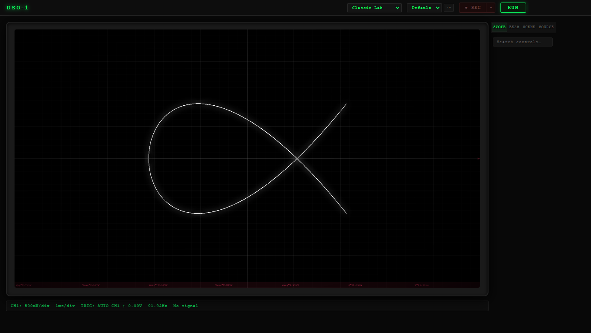
</p>

The signal generator creates two independent oscillators — one for the left (X) channel and one for the right (Y) channel. In XY mode this produces Lissajous figures whose shape is determined by the frequency ratio, phase offset, and waveform type.

### Controls

| Control | Range | Effect |
|---------|-------|--------|
| **Freq L** | 1–2000 Hz | X-axis oscillator frequency |
| **Freq R** | 1–2000 Hz | Y-axis oscillator frequency |
| **Phase** | 0–360° | Phase offset between L and R |
| **Waveform** | Sine / Square / Triangle / Sawtooth | Waveshape — changes figure geometry |
| **Amplitude** | 0–1 | Output level |

### Ratio Presets

Six L:R ratio shortcuts: **1:1 · 1:2 · 2:3 · 3:4 · 3:5 · 5:8** — clicking a ratio button keeps L fixed and updates R to match.

<p align="center">
  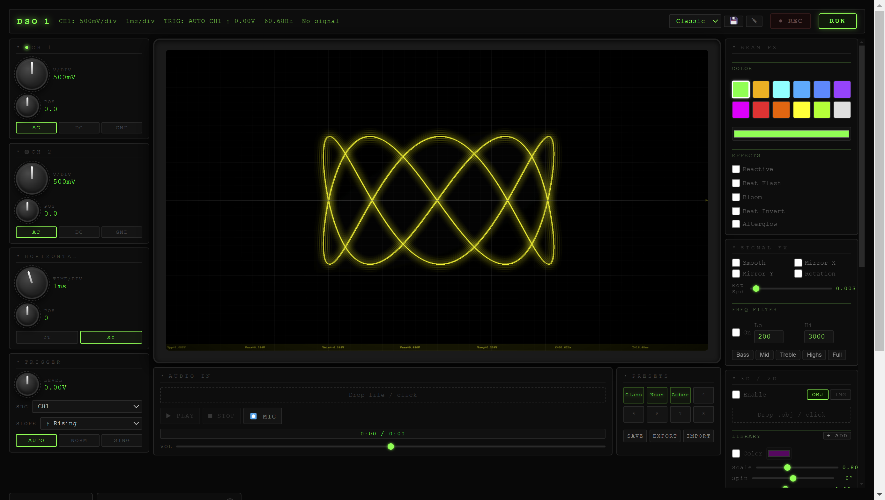
</p>

### OBJ Shape Library

Rather than hard-coded shape buttons, the generator panel includes a personal **OBJ file library**. Drop any `.obj` file onto the OBJ drop zone to load it — it renders as a phosphor wireframe in place of the signal waveform. Add files to the library with **+ ADD** and they persist across sessions by path reference (no copying).

**Lissajous quick-reference:**

| Shape | Ratio | Phase | Wave |
|-------|-------|-------|------|
| Circle | 1:1 | 90° | Sine |
| Figure 8 | 1:2 | 0° | Sine |
| Heart | 1:2 | 55° | Triangle |
| Star | 1:2.5 | 90° | Sine |
| Spiral | 1:1.007 | 90° | Sine |
| Diamond | 1:1 | 90° | Triangle |
| Web | 1:1.75 | 0° | Sine |
| Chaos | 1:π/2 | 37° | Sawtooth |
| Flower | 1:1.5 | 90° | Sine |
| Bowtie | 1:0.5 | 0° | Sine |

---

## Beam Effects

<p align="center">
  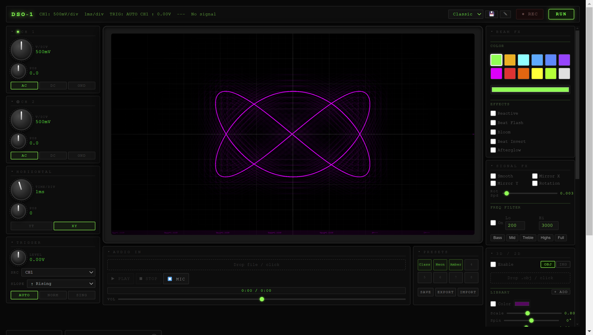
</p>

All effects run on the GPU in the WebGL composite shader — no Canvas 2D involved.

### Colors

12 preset phosphor colors plus a custom hex picker:

<table>
  <tr>
    <td>🟢 Classic Green</td>
    <td>🟡 Amber</td>
    <td>🔵 Cyan</td>
    <td>💙 Blue</td>
  </tr>
  <tr>
    <td>🟣 Indigo</td>
    <td>🟣 Violet</td>
    <td>🟣 Magenta</td>
    <td>🔴 Red</td>
  </tr>
  <tr>
    <td>🟠 Orange</td>
    <td>🟡 Yellow</td>
    <td>🟢 Lime</td>
    <td>⚪ White</td>
  </tr>
</table>

Scenes (OBJ/image) can have an **independent color** separate from the waveform beam.

<p align="center">
  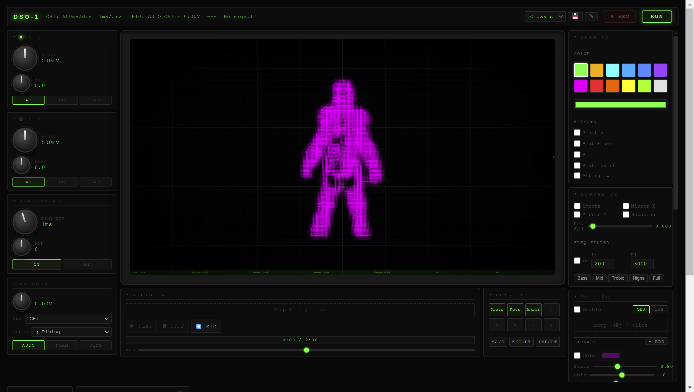
</p>

### Effect Reference

| Effect | What it does | Tunable |
|--------|-------------|---------|
| **Reactive** | Beam width and glow expand with audio RMS amplitude | Strength |
| **Beat Flash** | Burst of color brightness on detected beat | Strength, sensitivity |
| **Beat Invert** | Beam flips to white on beat | — |
| **Bloom** | Wide multi-pass glow halo rendered in 3 blur layers | Strength |
| **Afterglow** | Phosphor persistence trails with configurable decay | Persistence, hue-shift speed |
| **Mirror X** | Horizontal flip copy drawn alongside the original | — |
| **Mirror Y** | Vertical flip copy | — |
| **Rotation** | Slow continuous spin around the canvas center | Speed |

### Afterglow

<p align="center">
  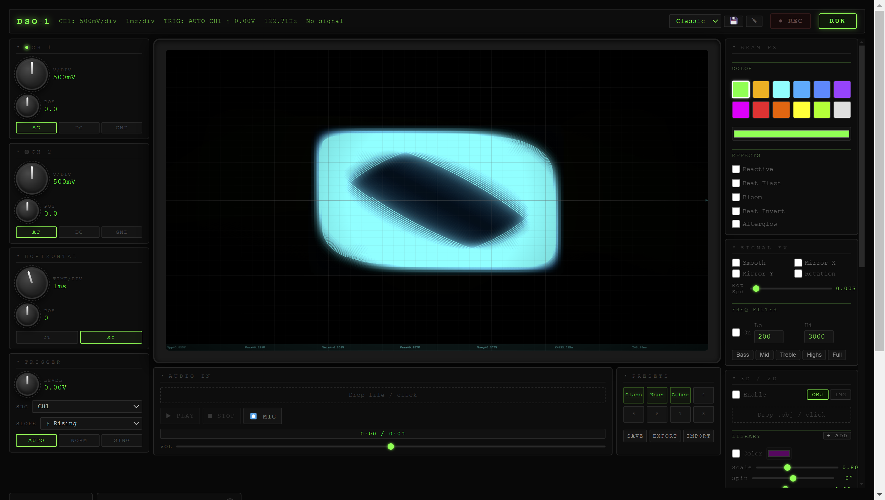
</p>

Afterglow replaces the standard phosphor trail with a hue-shifting version. Each frame the phosphor buffer is rotated through the color wheel by a tunable amount — at higher speeds the trails become full rainbow streaks.

### Mirror + Rotation

<p align="center">
  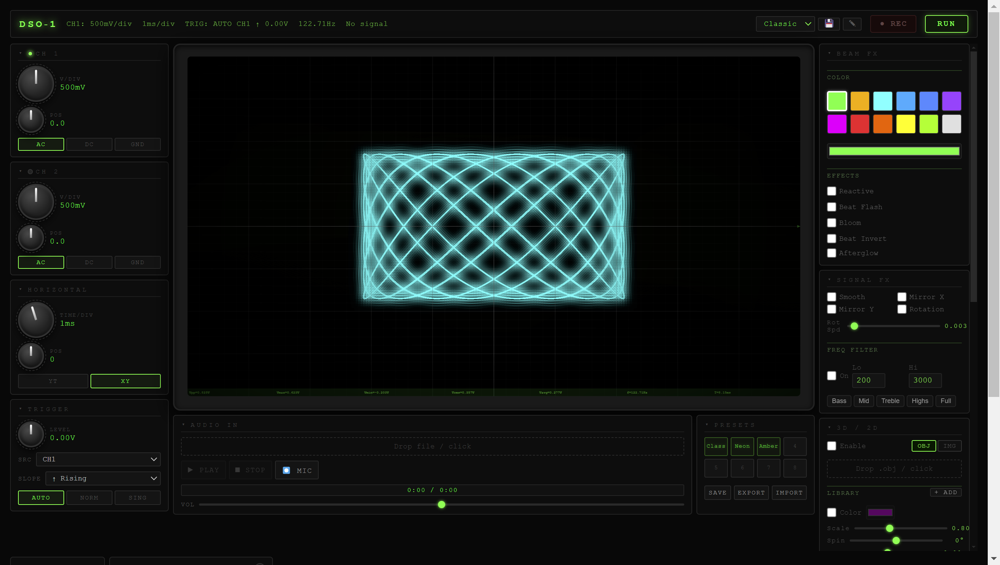
</p>

Mirror X and Y each add a flipped copy of the current frame. Enable both for quad symmetry. Combined with Rotation, this produces kaleidoscope-style patterns.

---

## Frequency Filter

<p align="center">
  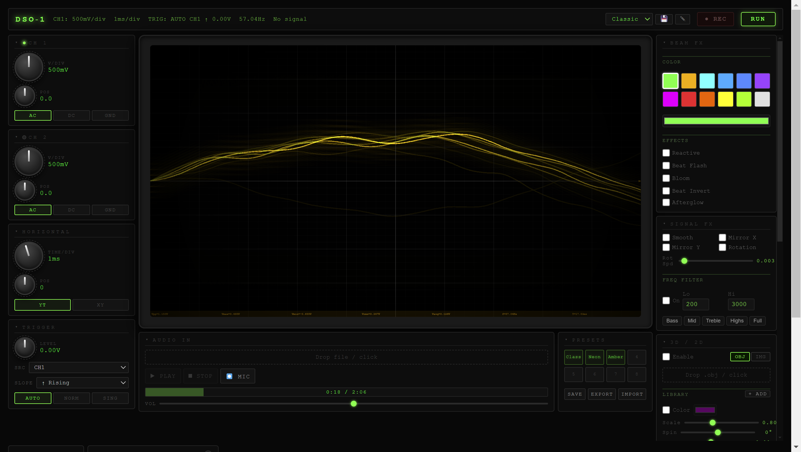
</p>

A two-pole biquad band-pass filter (high-pass + low-pass in series) applied to the audio signal before rendering. Isolating frequency bands dramatically changes the shape and movement of the waveform.

**Quick presets:**

| Preset | Range | Character |
|--------|-------|-----------|
| Bass | 20–250 Hz | Low fundamental, slow swings |
| Mid | 250–2000 Hz | Vocals, guitars |
| Treble | 2–6 kHz | Presence, harmonics |
| Highs | 6–20 kHz | Air, cymbals |
| Full | 20–20k Hz | Unfiltered |

Manual Lo/Hi sliders for precise control between 20 Hz and 20 kHz.

> The filter affects both the oscilloscope waveform and the signal fed to scene Warp mode — a bass-only filter makes Warp react to kick drums, a treble filter makes it react to hi-hats.

---

## 3D / 2D Scene Mode

Scenes replace or overlay the waveform with geometry derived from a 3D model or image. Toggle with the **3D** button or press **3**.

### 3D OBJ Mode

Load any Wavefront `.obj` file. The parser extracts edges from face definitions, normalizes the geometry to fit the viewport, and projects it with full 3D rotation math (Euler angles, Rz → Rx → Ry order).

**Controls:**

| Control | Description |
|---------|-------------|
| Scale | Model size (0.1–2.0) |
| Position X/Y | Canvas offset |
| Rot X / Y / Z | Manual rotation angles |
| Auto-Rotate X/Y/Z | Per-axis continuous spin with independent speed |
| Draw Power | How much of the edge list is drawn (0–100%) |
| Auto Ramp | Animate Draw Power from 0→1 automatically |

### 2D Image Mode

<p align="center">
  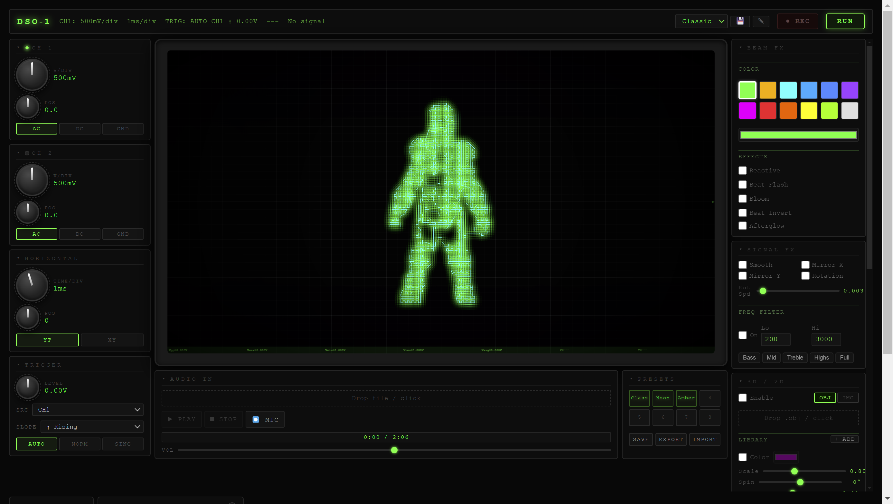
</p>

Images are rasterized at configurable density, then converted into phosphor trace paths. Three sampling modes:

#### Outline Mode

<p align="center">
  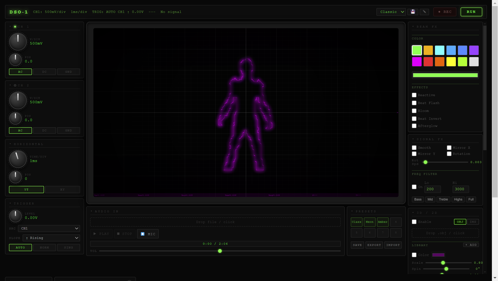
</p>

Traces the alpha-channel boundary of the image. Pixels that are opaque but have at least one transparent neighbor are included. Best for PNG/SVG with transparent backgrounds — produces a clean silhouette edge.

#### Edges Mode (Sobel)

<p align="center">
  
</p>

Runs a Sobel gradient operator across the image luminance. Detects intensity discontinuities — works on any image regardless of transparency. Picks up facial features, textures, object boundaries. Points are sorted into a continuous path via greedy nearest-neighbor to produce connected line traces rather than scattered dots.

#### Luminance Mode

<p align="center">
  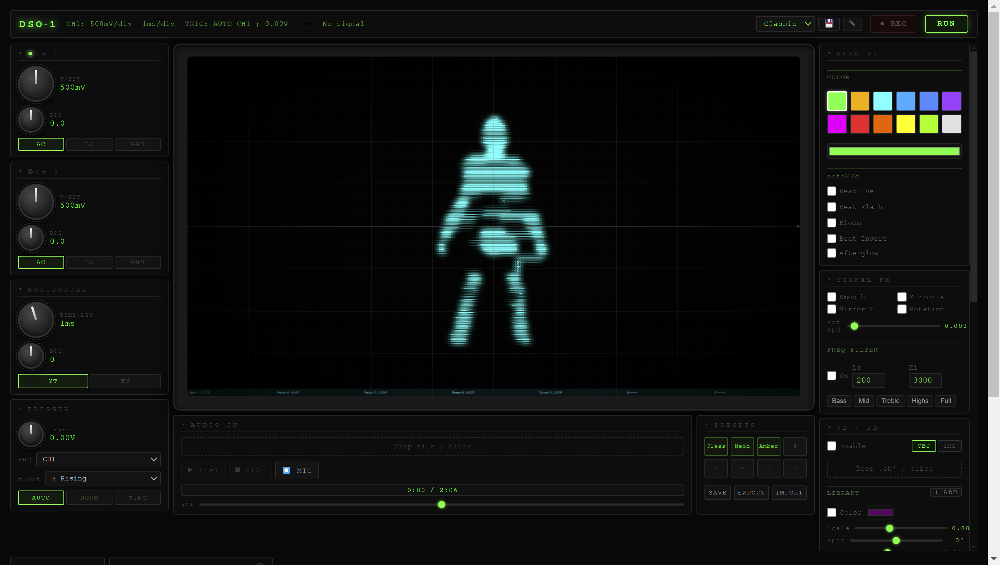
</p>

Includes every pixel above a brightness threshold. The threshold slider controls how much of the image fills in — lower values include shadows, higher values show only bright highlights. Points are rendered in scan order (no path sort) for clean horizontal runs.

**True 3D rotation** is available for images: the image plane can be rotated around X and Y axes with perspective divide, making the flat image appear to tilt in 3D space.

### Shared Scene Controls

#### Tiling

<p align="center">
  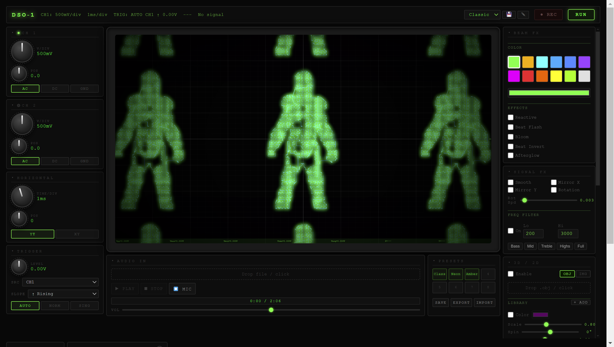
</p>

Repeat the scene in a grid — up to 5 columns × 5 rows. The total segment budget is automatically capped (80,000 max) and the source is downsampled uniformly if needed to maintain performance.

#### Radial Symmetry

<p align="center">
  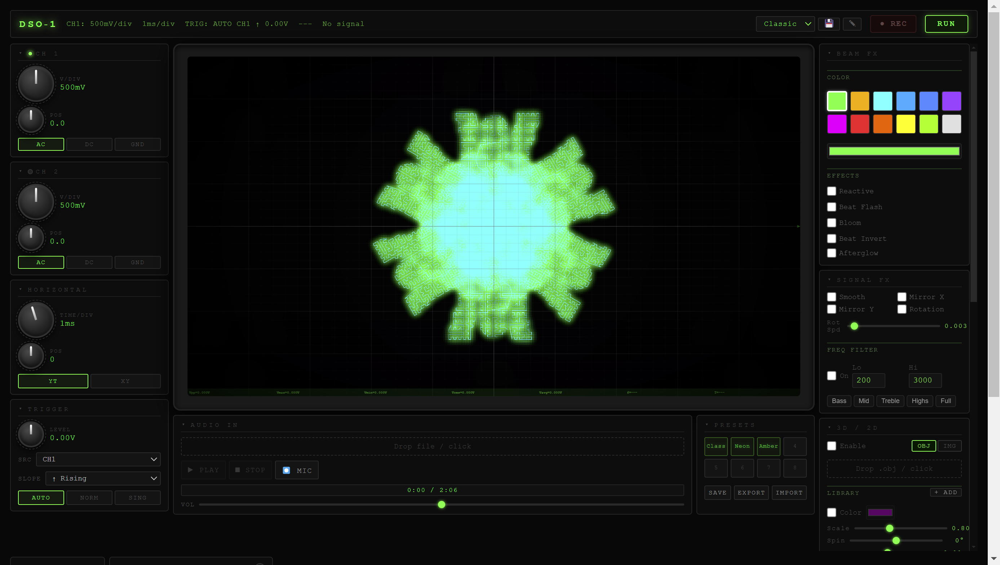
</p>

Arrange 1–8 rotated copies of the scene in a ring around the canvas center. At 6 copies with a model that has left-right symmetry, this produces mandala-style patterns.

#### Infinite Scroll

<p align="center">
  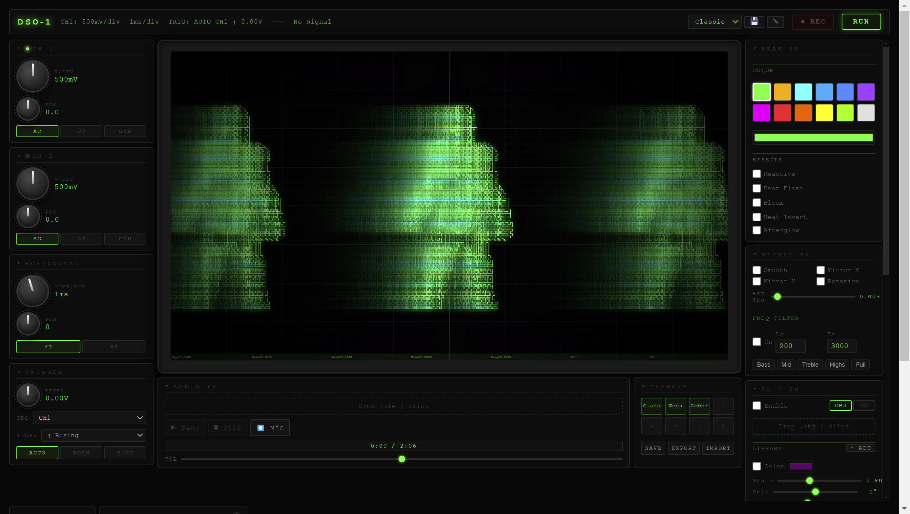
</p>

Scroll the tiled grid continuously in X and/or Y. The offset wraps at exactly one tile period so the grid appears infinite with no seam. Speed is in tile-widths per second.

---

## Movement FX

<p align="center">
  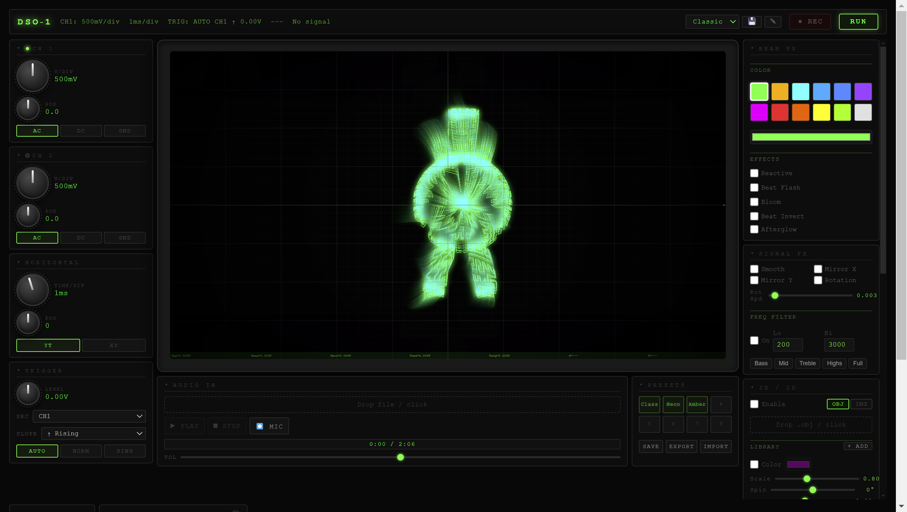
</p>

Four post-projection movement effects applied to the final screen-space geometry. They stack — all four can run simultaneously. Two shared controls drive every active effect:

- **Amt** — displacement intensity (0.05–1.0)
- **Speed** — animation rate multiplier (0.1–5.0)

### Float

Sinusoidal XY drift using two independent phase oscillators running at slightly different rates (X and Y are offset by ~golden ratio). The object bobs gently and non-repetitively, never looping in a predictable pattern.

### Ripple

<p align="center">
  
</p>

Expands concentric ring waves outward from the canvas center. Each screen-space point is displaced radially based on `sin(distance × rings − time)`. Three simultaneous rings travel through the geometry, creating a pond-ripple distortion across the entire visible field (including tiled copies).

### Twist

<p align="center">
  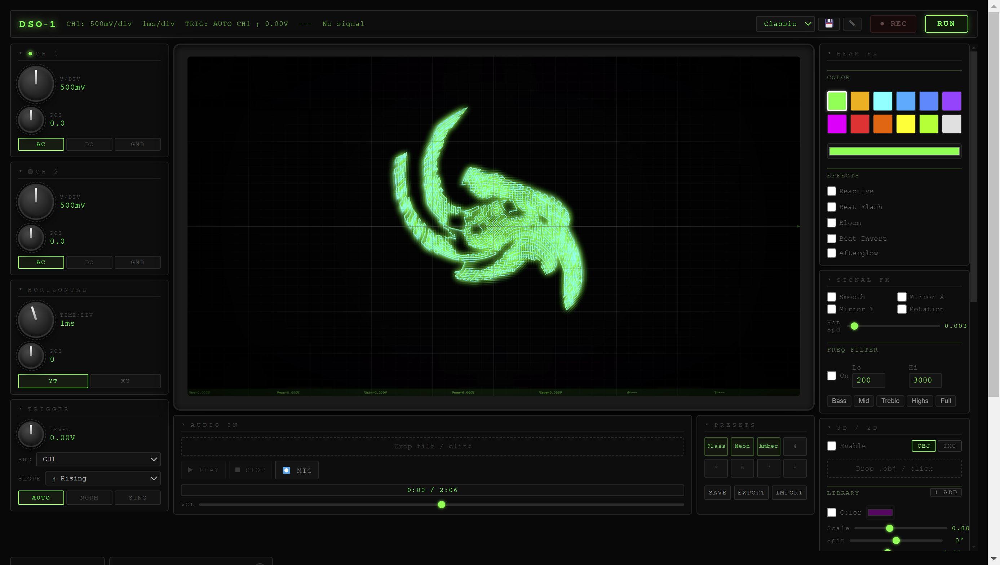
</p>

Rotates each point by an angle proportional to its distance from center. Points near center barely move; outer points swing through larger arcs. The twist phase winds continuously — the geometry spirals, unwinds, and re-spirals over time. Amt controls the peak rotation angle (up to ±270°).

### Explode

<p align="center">
  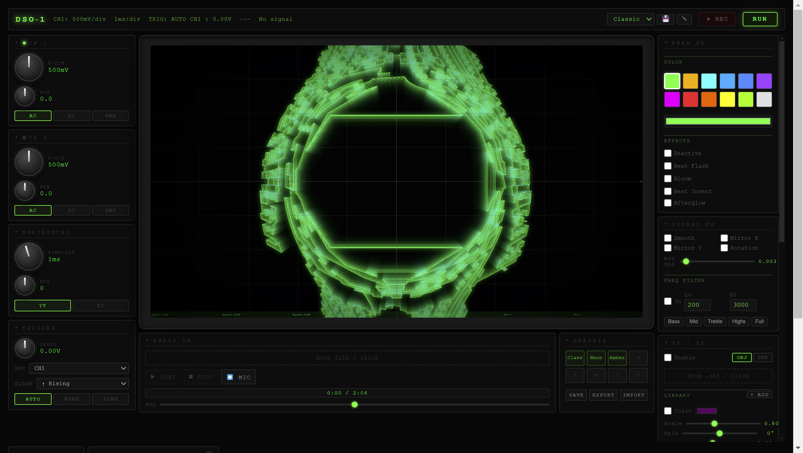
</p>

Pushes every point radially outward from center using an ease-in/ease-out curve — a fast burst that settles. Without **Loop Explode** the geometry drifts to its maximum extent and holds. With Loop Explode checked it resets and fires again continuously. Enabling Explode always resets the phase so the burst starts immediately.

---

## Music-Reactive Scene Modes

<p align="center">
  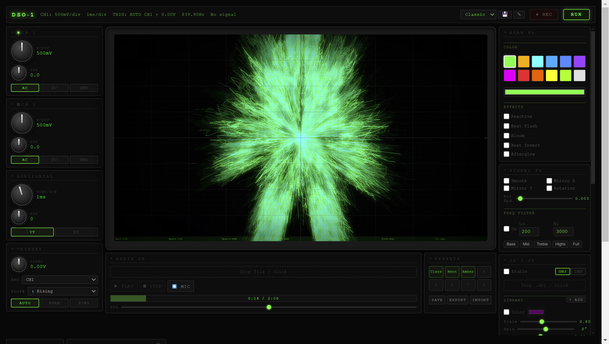
</p>

These modes make the scene geometry respond directly to the audio signal.

| Mode | How it works |
|------|-------------|
| **Beat Pulse** | Scale spikes briefly on each detected beat, then decays smoothly |
| **Breathe** | Scale continuously follows RMS amplitude — loud audio = bigger object |
| **Shake** | Position jitters randomly on beat detection, decays between beats |
| **Warp** | Each edge endpoint is displaced radially using a sample from the audio waveform buffer mapped to the point's angle — the object appears to stretch and distort with the music |
| **Audio Sketch** | (Image mode) Trace density follows amplitude — loud sections draw fully, quiet sections go sparse |
| **Show Audio** | Adds the waveform on top of the scene instead of replacing it |

---

## Draw Power

<p align="center">
  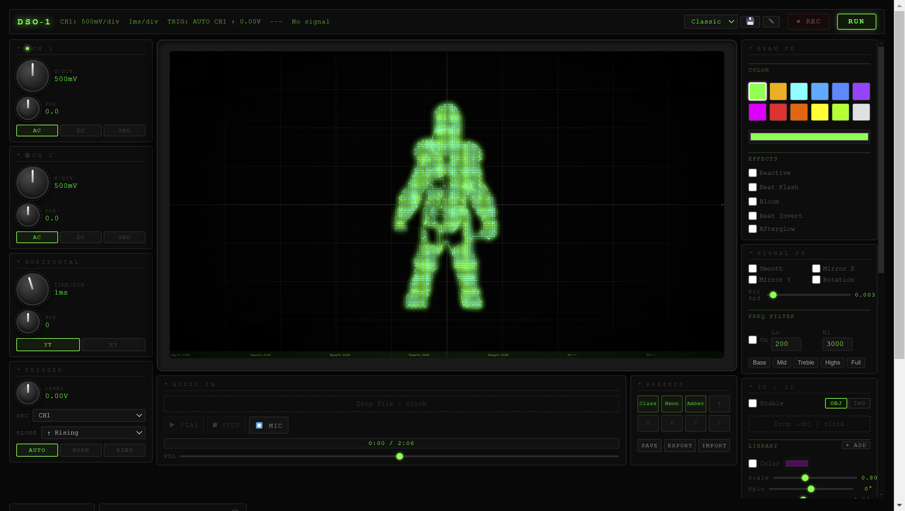
</p>

Draw Power slices the edge/trace array — at 0.0 nothing is drawn, at 1.0 all geometry is visible. Combined with **Auto Ramp**, the scene animates from blank to fully drawn in real time. **Loop** restarts the ramp automatically for a continuous write-on effect. **Rate** controls how fast the ramp travels.

This works identically for both OBJ wireframes and image traces.

---

## CRT Emulation

The WebGL pipeline simulates a real phosphor CRT:

- **Persistence** — the phosphor buffer decays each frame by a configurable factor. Low values = fast fade, high values = long glowing trails
- **CRT Curve** — a radial vignette darkens the corners, mimicking the curved glass of a vintage scope
- **Grid** — fine subdivision lines + major division lines + center crosshair, all batched into single draw calls
- **Beam width** — controls the core line thickness
- **Glow** — controls the Gaussian blur radius around the beam

---

## Presets

<p align="center">
  
</p>

Save complete oscilloscope snapshots — channels, timebase, trigger, beam effects, scene settings, motion FX, display parameters — all stored in a single preset slot.

- **8 save slots** with custom names
- **3 built-in presets**: Classic · Neon Glow · Amber Retro
- **Export** any preset or all slots as a `.json` file
- **Import** presets from JSON to share setups between machines
- Click a slot to recall it instantly; click during SAVE mode to overwrite it

---

## Layout Rigs

<p align="center">
  
</p>

Panels can be dragged between four drop zones and collapsed or expanded. Four built-in rigs:

| Rig | Description |
|-----|-------------|
| **Classic** | All panels in a horizontal strip below the scope |
| **Studio** | Balanced split — channels left, effects right, audio centered |
| **Perform** | Minimal controls, effects prominent, scope maximized |
| **Minimal** | Everything collapsed to a narrow right sidebar |

Rig controls live in a compact **⋯** dropdown menu in the topbar. The dropdown exposes: Save, Update, Delete, Edit Mode, and Toggle Layout. Built-in rigs cannot be updated or deleted — those actions are only available for custom rigs you save. All layout state (panel positions, collapsed state, active rig) persists in localStorage.

---

## Themes

<p align="center">
  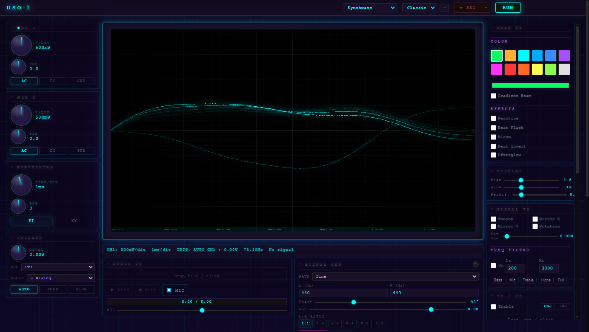
</p>

10 built-in visual themes, each with a distinct aesthetic personality. Select via the theme picker dropdown in the topbar — the choice persists in localStorage.

| Theme | Character |
|-------|-----------|
| **Classic Lab** | Default green phosphor on dark panels |
| **Tektronix Blue** | 80s bench equipment aesthetic — chunky beveled panels, scanline overlay |
| **Analog Amber** | Vintage CRT terminal, brushed metal, serif typography |
| **MIL-SPEC** | Military equipment styling — monospace stencil font, zero border-radius, cross-hatch texture |
| **Modern Minimal** | Light theme — white panels, pill buttons, hairline borders |
| **Synthwave** | Neon glow borders, perspective grid, chrome knobs |
| **Wooden Rack** | Studio rack aesthetic — wood grain texture, brass knobs, serif font |
| **OLED Dark** | True black background, white trace, minimal UI chrome |
| **Nixie Tube** | Warm orange glow, glass-tube bezel, vignette |
| **Frosted Glass** | Glassmorphism — translucent panels with backdrop blur |

---

## Recording & Output

### Video Recording

The record button is a split-button with a dropdown to select the recording mode — the choice persists in localStorage.

**Standard** — records to **WebM** (VP8 codec). Click to start, click again to stop and save. Files go to your downloads folder with a timestamp filename.

**Transparent (α)** — records WebM with VP8 and a real alpha channel. The composite shader outputs luminance as alpha, so the phosphor beam is transparent against black. Files get an `_alpha.webm` suffix. Ready for compositing in After Effects or Premiere without any chroma keying.

### Screenshots

The camera button saves the current frame as a timestamped **PNG** to your downloads folder.

### Pop-Out Display

Click **⤢ POP OUT** to open a second window containing only the scope display — no controls, no panels. Resize it independently, drag it to a second monitor, and run the controls from the main window. The pop-out renders its own isolated canvas at whatever resolution you set.

---

## Keyboard Shortcuts

| Key | Action |
|-----|--------|
| `Space` | Play / Pause audio |
| `Esc` | Stop audio |
| `G` | Toggle grid |
| `C` | Toggle CRT curve |
| `M` | Toggle measurements |
| `F` / `F11` | Toggle fullscreen |
| `1` | YT mode |
| `2` | XY mode |
| `3` | Toggle scene mode on/off |
| `Tab` | Switch OBJ / Image scene |
| `R` | Run / Stop scope |
| `S` | Single trigger |
| `A` | Auto Set (auto-fit V/DIV + timebase) |
| `?` | Show shortcut help overlay |

Keyboard shortcuts can be remapped to MIDI input via the InputMapper.

---

## Easter Eggs

<p align="center">
  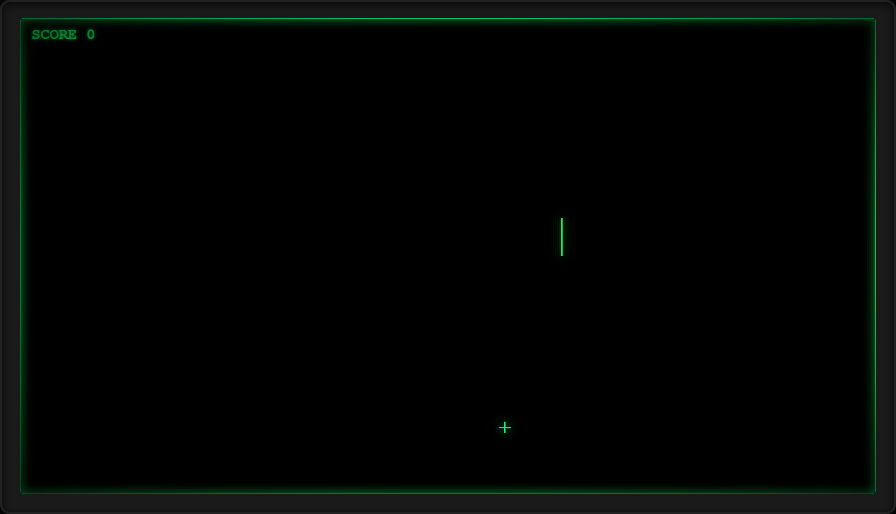
</p>

Enter the **Konami code** (↑ ↑ ↓ ↓ ← → ← → B A) to launch a Snake game rendered through the WaveGL beam pipeline — the snake and food are drawn as phosphor geometry on the scope display. Arrow keys to steer, Space to restart, Esc to exit.

---

## Installation

### From Source

```bash
git clone https://github.com/HesNotTheGuy/Oscilloscope.git
cd Oscilloscope
npm install
npm start
```

### Build Installer

```bash
# Windows NSIS installer
npm run dist:installer

# Portable executable (no install)
npm run dist:portable
```

Outputs go to the `dist/` folder.

---

## Tech Stack

| Component | Technology |
|-----------|-----------|
| Framework | Electron 33 |
| Rendering | WebGL — GPU Gaussian blur, phosphor persistence, GLSL shaders |
| Fallback | Canvas 2D with composite blend modes |
| Audio | Web Audio API — AnalyserNode, real-time FFT, biquad filter chain |
| Recording | MediaRecorder API — VP8/WebM encoding, real-alpha transparent capture |
| 3D | Custom Wavefront `.obj` parser, Euler rotation, perspective projection |
| Image Trace | Sobel edge detection, greedy nearest-neighbor path sort, alpha boundary |
| Layout | HTML5 Drag and Drop API, localStorage persistence |
| Architecture | Modular ES modules — domain controllers under `src/ui/` |
| Testing | Vitest — 134 unit tests |
| Themes | 10 built-in CSS themes with scope parameter presets |

---

## Requirements

- **Node.js** 18+ (build from source only)
- **Windows** 10 / 11 (primary platform)
- **GPU** with WebGL support — any modern integrated or discrete GPU

---

## License

MIT

---

<p align="center">
  <sub>Built with Electron &bull; Rendered with WebGL &bull; Driven by music</sub>
</p>
