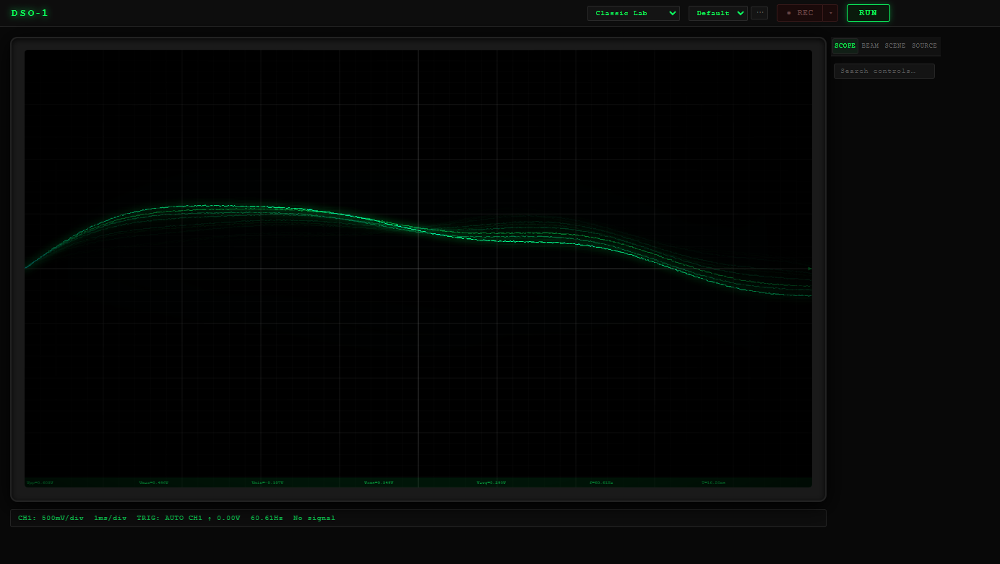

# DSO-1 Oscilloscope



DSO-1 is a desktop digital oscilloscope that draws audio in real time.

## Install

Download a built app from the [GitHub Releases page](https://github.com/HesNotTheGuy/Oscilloscope/releases).

From source:

```bash
npm install
npm start
```
